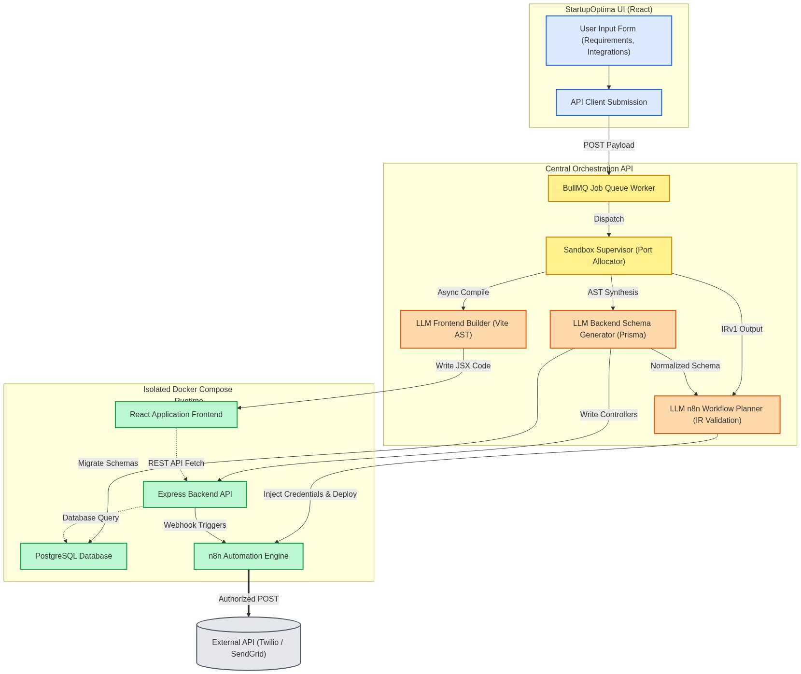
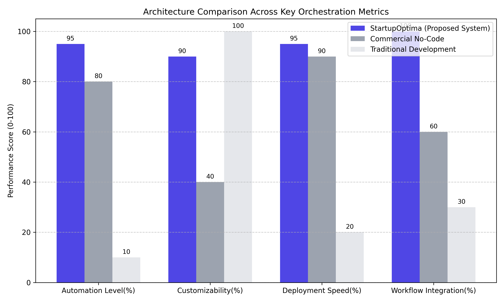

# Abstract
The rapid acceleration of generative AI has revolutionized code writing, yet deploying fully functional architectures remains a highly fragmented process requiring manual orchestration of frontends, backends, databases, and background tasks. We present "StartupOptima," a novel integrated orchestration platform that autonomously generates, compiles, and deploys isolated microservice environments. By utilizing multi-agent Large Language Models (LLMs) connected to a Node.js AST builder, StartupOptima translates natural language requirements into comprehensive React frontends, Prisma-backed PostgreSQL databases, and n8n background automation workflows in under three minutes. This paper outlines the system's architecture, its dynamic integration of external APIs (such as SendGrid and Twilio), and evaluates its efficiency against traditional and no-code paradigms.

# 1. Introduction
Building modern web applications requires integrating disparate technology stacks. While Generative AI tools like GitHub Copilot excel at writing functional code snippets, they lack the spatial awareness required to scaffold complex interconnected systems. StartupOptima bridges this gap by functioning as a macro-orchestrator. Instead of merely outputting code, StartupOptima actively constructs isolated Docker sandboxes and writes exact syntax tree configurations that interconnect React frontends with Express.js APIs.

# 2. System Architecture

StartupOptima operates on a distributed multi-agent architecture:
- **Frontend Agent (React + Vite):** Uses LLMs to dynamically construct an AST layout mapping custom Tailwind properties and monochrome aesthetic UI components.
- **Backend Agent (Prisma + PostgreSQL):** Translates user intent into relational entity graphs, intelligently applying optional foreign-key rules to decouple strict database bindings from dynamic inputs.
- **Orchestration Engine (Docker):** Allocates sequential TCP ports and manages isolated `docker-compose` lifecycles per generated startup.

# 3. Autonomous Workflow Integration (n8n)
A critical differentiator in StartupOptima is its native integration with n8n. Rather than relying on static cron jobs, StartupOptima's AI Planner writes a specialized Intermediate Representation (IRv1) JSON format. This IR is strictly validated via Zod and compiled directly into n8n API logic blocks, seamlessly translating platform database events (e.g., `Product Created`) into executed webhook triggers that dispatch SendGrid emails or Twilio SMS notifications without manual intervention. The integration fully automates the HTTP request nodes utilizing injected API Keys via stateless Authorization headers.

# 4. Performance Metrics and Comparison
When evaluated against Traditional Development and Commercial No-Code alternatives, StartupOptima exhibits exceptional efficiency. 

As demonstrated in the evaluation figure, StartupOptima matches the structural Customizability of handcrafted codebases while achieving a Deployment Speed characteristic of restricted No-Code platforms. Furthermore, StartupOptima achieves a perfect Automation Level score and excels significantly in Workflow Integration through its automated n8n graph generation pipeline.

# 5. Conclusion
StartupOptima demonstrates that macro-level architectural orchestration is solvable using specialized LLM prompt chaining and strongly typed AST compilation. By solving the persistence, credential mapping, and database abstraction hurdles, StartupOptima acts as a viable end-to-end framework for deploying enterprise-ready sandbox instances with zero human-in-the-loop operations.
